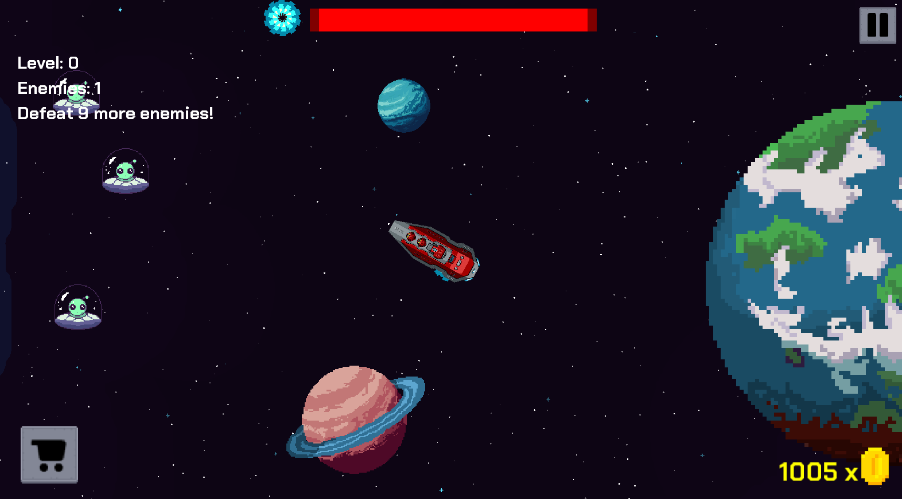
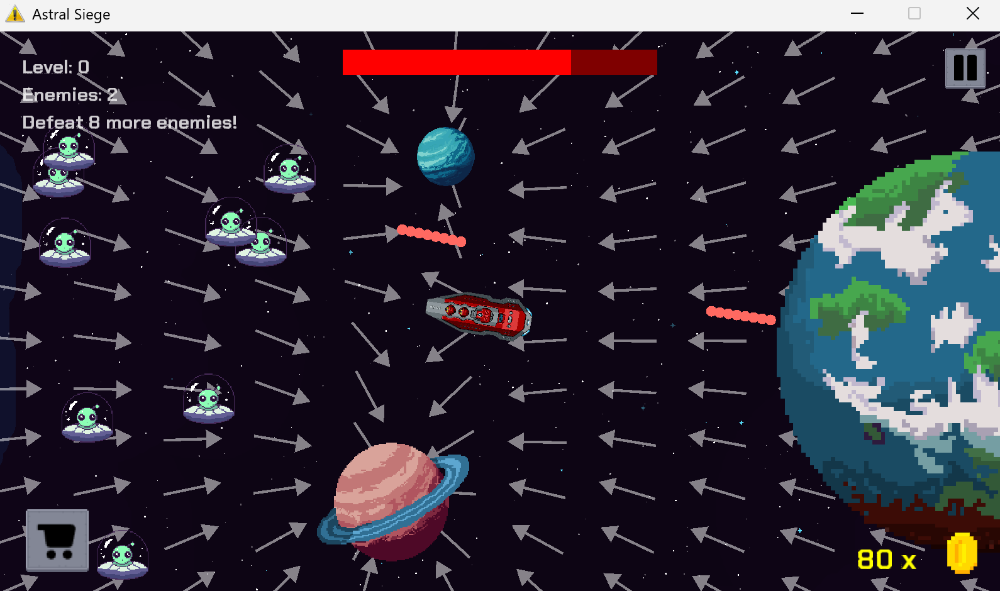

# Astral Siege

A game developed for the module Software Engineering Project II (CSD1451) at DigiPen Institute of Technology.

## Building

Open `AstralSiege.sln` in Visual Studio and build the solution.

## Team

- Choi Meng Yew
- Guok Yi Yong
- Javier Lee Shi Bin
- Chloe Lau Rey En
- Celeste Tong Jia Xuan

## About

Astral Siege is a fast-paced tower defense game where humanity's last line of defense 
is you. Place turrets, aim your weapons, and unleash bullets and missiles against relentless 
waves of alien enemies. Manage your currency wisely, account for gravity when you shoot, and 
hold the line across 3 increasingly brutal levels. Destroy enough enemies, upgrade your 
telescope, and push the alien horde back before it's too late.

## Screenshots

## Built With

- C++
- DigiPen's Alpha Engine
- Visual Studio 2022

## How to Run

**Option 1 - Run directly:**
Open `bin/` and run the `.exe`

**Option 2 - Build from source:**
Open `AstralSiege.sln` in Visual Studio and press `Ctrl+F5` to build and run.

## Acknowledgements

DigiPen Institute of Technology, Singapore
